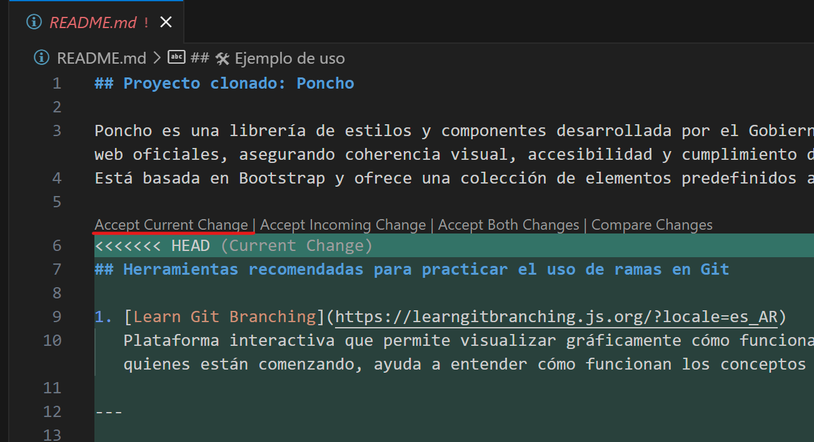
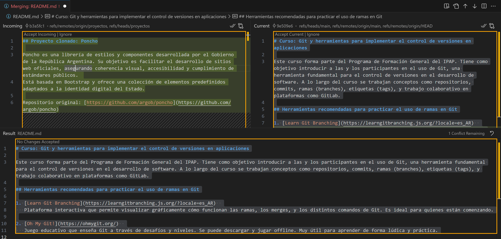

# Conflictos en repositorio

Al realizar dos cambios separados en los brachs `main` y `proyectos` respectivamente, se producieron conflictos al realizar el merge.

## Realización de merge

Se realizó de forma local (no `pull-request`) mediante los comandos:

```bash
git switch main
git merge proyectos
```

Dió el siguiente mensaje

```bash
Auto-merging README.md
CONFLICT (content): Merge conflict in README.md
Auto-merging TRABAJO.md
Automatic merge failed; fix conflicts and then commit the result.
```

## Resolución de conflictos

Mediante `Visual Studio` se pueden resolver los conflictos, además que muestras las diferencias de manera simple y gráfica.



En nuestro caso, la mejor opción era **Accept Current Change**.

### Opcional Merge Editor

Usando el `merge editor` de Visual Studio Code, se pueden ver los cambios realizados en cada branch y seleccionar cuál se quiere conservar.

#### Merge editor


Luego de resolver los conflictos, se debe agregar el archivo modificado al stage area y realizar el commit.

```bash
git add README.md
git commit -m "Merge proyectos con main"
``` 